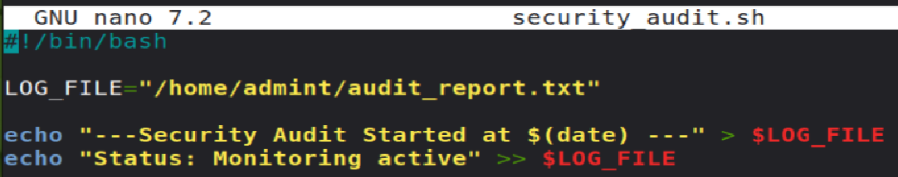
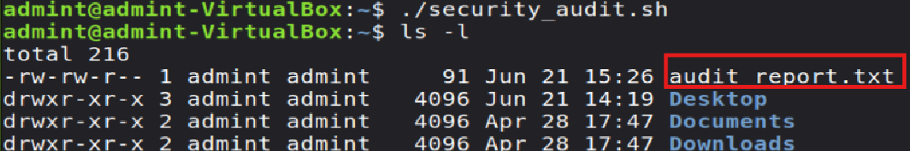
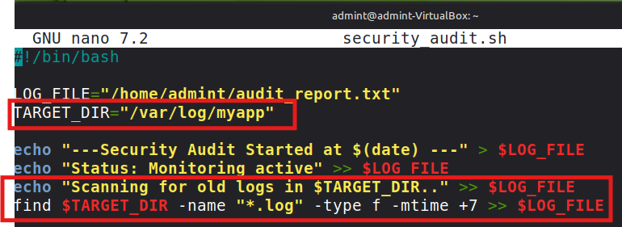
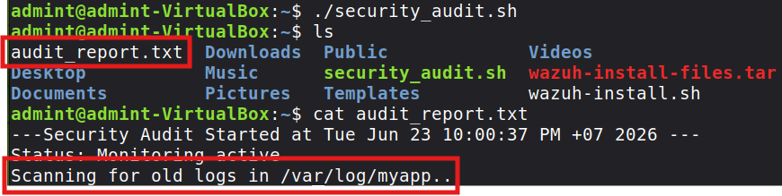

# Automated-Log-Management-Security-Auditing-System

This project uses **Bash Script** to automate log management and security auditing. It collects critical logs, analyzes suspicious activities, and generates fast security reports for administrators.

This project is developed and running on **Linux Mint**.

### 🚀 Phase 1: Creating the Script and Setting up the Base Code

In this step, we create the `security_audit.sh` file and write the initial base structure.

**Command:** nano security_audit.sh

Add this code into the script file

* `LOG_FILE="/home/admint/audit_report.txt"`                  : Defines the path where the audit report file will be saved.
* `echo "---Security Audit Start at $(date) ---" > $LOG_FILE` : Creates the report file and records the exact start date and time.
* `echo "Status: Monitoring active" >> $LOG_FILE`             : Appends the current system monitoring status to the end of the file.

**Making the Script Executable**
To run the script, you need to change its file permissions using the `chmod`
**Command:** chmod +x security_audit.sh

**Note:** Using `chmod +x` grants executable permissions to the file, allowing the system to run it as a program.
Use code with caution.

Run the script and verify the output by using the following 
**Commands:**
./security_audit.sh

The command output will look like this

### 🔍 Phase 2: Log Filtering and Management (The Filtering Logic)
Clean up expired logs to free up storage without affecting critical system files.

* **`find`**: Best for scanning and bulk-deleting residual files based on conditions (e.g., daily log cleanup).
* **`sleep && rm`**: Best for delayed deletion of a specific file like a "time bomb" (e.g., removing a temporary file 5 minutes after use).
Use code with caution.

#### Example: Managing files older than 7 days in `/var/log/myapp`
Add this code into the script file

* `TARGET_DIR="/var/log/myapp"`                                   : Defines the target directory path where the script will search for log files.
* `echo "Scanning for old logs in $TARGET_DIR..."` >> $LOG_FILE   : Appends a progress message to the report file, showing which directory is being scanned.
* `find $TARGET_DIR -name "*.log" -type f -mtime +7` >> $LOG_FILE : Searches for .log files older than 7 days in the target directory and appends the list of found files to the report.

* **`-name "*.log"`**: Restricts the search to files ending with the `.log` extension.
* **`-type f`**: Limits the search to "files" only (excluding directories) for safety.
* **`-mtime +7`**: Finds files last modified more than 7 days ago.
* **`-mmin +5`**: Finds files older than 5 minutes (perfect for quick testing without waiting 7 days).
Use code with caution.

**Note:** Never use the `-delete` option right away. Always verify that your `find` command targets the correct files first. It is highly recommended to output (echo) the file list into a log file for review before executing any actual deletion.

Run the script and verify the output by using the following 
**Commands:** 
./security_audit.sh

The command output will look like this 

The output does not show any `.log` files because of the `-mtime +7` condition, which looks for files older than 7 days. Since our test files were created just 5 minutes ago, they do not match the criteria and are excluded from the search results.

### ⏰ Phase 3: Automating the System with Crontab
Instead of manually running the script every day, we can register it as a scheduled task in the system (via Crontab) to automatically execute the log cleanup script every midnight.

**Method 1: The Standard Approach (Manual Editor)** 

Open the Crontab configuration editor by running: `crontab -e`

Scroll to the bottom of the file and append the following line (make sure to replace `/path/to/` with your actual script path): `0 0 * * * /path/to/security_audit.sh`

#### **Method 2: The Pro Approach**
In Cloud Security operations, setups are often automated across multiple systems. You can use Linux Pipes (`|`) and Redirection to inject the task into Crontab instantly without opening an interactive editor: `(crontab -l 2>/dev/null; echo "0 0 * * * /path/to/security_audit.sh") | crontab -`

